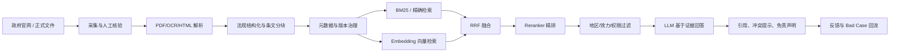

# 城市规划法规 RAG：真实项目拆解与技术选型

## 1. 项目应该怎样定义

### 一句话定位

面向规划设计、项目报建和审批辅助人员，提供可追溯、可核验、能够识别地区与法规版本的城市规划法规检索问答服务。

### 为什么这个场景适合 RAG

| 判断维度 | 城市规划法规场景 | 结论 |
|---|---|---|
| 知识是否频繁变化 | 法规、技术规定、办事指南会更新或废止 | 需要外部知识库 |
| 是否要求引用依据 | 用户必须知道答案来自哪份文件、哪一条 | 需要检索与引用 |
| 是否存在地区差异 | 国家、省、市及区县规则可能不同 | 需要元数据过滤 |
| 是否适合直接微调 | 微调无法可靠记住最新法规，也难提供引用 | 不应以微调为主 |
| 错误成本是否较高 | 错误可能影响设计和报建，但可通过人工核验兜底 | 适合辅助决策，不适合自动审批 |

选择 RAG 的核心理由不是“现在 RAG 很流行”，而是法规知识具有动态性、地域性和可追溯要求。模型参数负责语言理解，知识库负责事实依据。

### MVP 边界

第一阶段只覆盖一个城市的 20 至 50 份现行有效文件，聚焦建筑退让、规划许可、历史文化保护和公共服务设施配置。

系统输出属于法规检索辅助结果，不替代主管部门正式解释、设计审查或行政审批。

## 2. 真实项目的整体链路



面试时要按“数据先于模型”的顺序讲。法规来源、效力状态和条文结构错误，后面的模型无法补救。

## 3. 数据层设计

### 数据来源

真实项目优先采集：

1. 国家法律法规数据库与中国政府网发布的法律、行政法规；
2. 自然资源部及地方自然资源和规划主管部门官网；
3. 地方政府公报、规范性文件数据库；
4. 经业务专家确认的办事指南和审批口径。

不建议把搜索引擎结果或自媒体解读直接放入主知识库。它们可以作为线索，但不能作为最终证据。

### 为什么需要人工核验

网页可访问不代表文件仍然有效。真实项目中最危险的问题通常不是“没搜到”，而是“搜到了旧文件并自信回答”。

人工核验至少确认：

| 字段 | 需要确认的问题 |
|---|---|
| `source_url` | 是否为官方原文 |
| `authority` | 发布机关是否有权发布 |
| `effective_date` | 何时生效 |
| `status` | 现行有效、失效、废止还是草案 |
| `jurisdiction` | 适用国家、省、市或区县 |
| `supersedes` | 是否替代旧文件 |

### 文档解析选型

| 文档类型 | 推荐处理方式 | 原因 |
|---|---|---|
| HTML 正文 | DOM 结构化解析 | 标题、段落和链接保留最好 |
| 文本型 PDF | PyMuPDF / pdfplumber | 能直接提取文字与页码 |
| 扫描 PDF | OCR + 人工抽检 | OCR 容易把条款号、数字识别错 |
| Word | python-docx | 可保留段落和表格结构 |
| 表格附件 | 单独结构化 | 固定长度切分会破坏行列关系 |

法规中的数字、否定词和例外条件属于高风险信息。OCR 后应抽检“不得、不低于、不超过、米、平方米、百分比”等内容。

## 4. 分块策略

### 为什么不能只按 500 字切分

固定长度简单，但可能把“适用条件”和“例外条款”拆开。法规问答中，遗漏一个“除外”就可能让答案完全相反。

### 本项目采用的策略

当前代码在 [core.py](../app/core.py) 的 `split_regulation()` 中依次执行：

1. 优先按“第一条、第二条”切分；
2. 没有条款时按 Markdown 标题切分；
3. 无结构文档才按长度兜底。

生产版建议采用父子分块：

| 层级 | 内容 | 用途 |
|---|---|---|
| 父块 | 一章或一个完整主题 | 为生成模型补充上下文 |
| 子块 | 单条法规或条内款项 | 用于精准检索 |

检索命中子块后，把相邻条款或父块一起提供给生成模型。这样兼顾精确召回和完整语境。

## 5. 检索方案与模型选型

### 为什么必须做混合检索

法规查询同时存在两类问题：

| 查询类型 | 示例 | 最适合的方法 |
|---|---|---|
| 精确术语 | “示例规资发〔2026〕1号第四条” | BM25 / 全文检索 |
| 口语语义 | “高层楼离主干路要留多远” | Embedding 向量检索 |

只使用向量检索，文号、条款号和专业术语可能被稀释；只使用关键词检索，口语表达和同义词又可能无法命中。因此采用 BM25 + 向量检索，并通过 RRF 融合排名。

### Embedding 模型推荐

#### 推荐起点：Qwen3-Embedding-0.6B

选择理由：

- 支持多语言和较长上下文；
- 支持 query instruction，可以明确告诉模型当前任务是“检索城市规划法规条款”；
- 0.6B 规模适合作为成本和效果平衡的起点；
- 与 Qwen3-Reranker 有配套组合，便于统一评测和部署。

为什么不一开始使用最大模型：

- 模型越大，索引速度、显存和线上延迟成本越高；
- 在法规场景中，数据治理、条文分块和混合检索通常比盲目升级模型更重要；
- 应先用业务评测集证明小模型达不到目标，再升级。

#### 备选：BGE-M3

BGE-M3 的优势是同时支持 dense、sparse 和 multi-vector 检索，适合做更深入的混合检索实验。若团队希望减少多个检索模型之间的割裂，可以将其作为对照方案。

#### API Embedding 适用情况

项目早期或团队没有 GPU 运维能力时，可以使用 Embedding API 快速验证。缺点是数据合规、调用成本和供应商依赖需要额外评估。

### Reranker 推荐

候选条款召回后，使用 `Qwen3-Reranker-0.6B` 对 Query 与候选条款做二次相关性判断。

为什么需要 Reranker：

- Embedding 检索追求“不要漏”，通常会返回若干语义相近但不直接回答问题的条款；
- Reranker 同时阅读 Query 与文档，排序精度通常更高；
- 只对 Top 20 或 Top 50 候选运行，成本可控。

典型链路：

```text
BM25 Top 30 + Vector Top 30
  -> RRF 融合
  -> Reranker 精排 Top 20
  -> 元数据过滤
  -> 返回 Top 5 给生成模型
```

### 向量数据库推荐

#### MVP：SQLite FTS5

当前项目使用 SQLite，优点是零运维、便于理解和面试演示。缺点是向量能力、并发和分布式扩展有限。

#### 生产推荐：Qdrant + Elasticsearch

| 组件 | 负责内容 | 原因 |
|---|---|---|
| Elasticsearch | BM25、文号、条款号、精确术语检索 | 全文检索成熟 |
| Qdrant | 向量检索、元数据过滤 | 支持向量与过滤条件组合 |
| PostgreSQL | 文档元数据、审核流、版本关系 | 适合事务与治理 |
| 对象存储 | PDF、Word、原始文件 | 保存可追溯原件 |

当团队规模较小、文档量不大时，也可以先只使用 Qdrant 的 dense + sparse hybrid search，减少组件数量。选型不是越复杂越好，而是要匹配数据规模和团队运维能力。

## 6. 生成模型选型

### 生成模型负责什么

生成模型只负责：

- 理解用户问题；
- 综合已召回证据；
- 用清晰语言解释；
- 标注引用与冲突。

它不负责决定法规是否有效，也不应凭参数记忆补充知识库之外的结论。

### 模型路由策略

| 任务 | 推荐策略 | 原因 |
|---|---|---|
| 单条法规直接查询 | 小模型或摘录式回答 | 成本低，证据明确 |
| 多条法规归纳比较 | 强模型 | 需要综合与冲突说明 |
| 查询改写和意图分类 | 小模型 | 输出结构简单 |
| 高风险审批判断 | 不自动下结论，转人工 | 风险不可接受 |

模型选择应通过自己的评测集比较，而不是只看通用排行榜。重点评测引用正确率、无依据回答率、多版本冲突提示率和响应时间。

## 7. 为什么 RAG 而不是微调

| 维度 | RAG | 微调 |
|---|---|---|
| 更新法规 | 更新知识库即可 | 需要重新训练 |
| 展示引用 | 天然支持 | 很难追溯 |
| 地区与版本过滤 | 通过元数据控制 | 难以可靠控制 |
| 学习回答风格 | 能做但不是主要优势 | 擅长 |

项目结论：事实知识用 RAG，固定输出格式、分类能力或领域表达风格可以考虑微调。二者不是互斥关系。

## 8. 评测体系

### 离线检索评测

| 指标 | 含义 | MVP 目标 |
|---|---|---|
| Recall@5 | 正确条款是否进入前 5 | >= 0.90 |
| MRR | 正确条款排名是否靠前 | >= 0.80 |
| 旧版误召回率 | 是否召回失效法规 | 0 |
| 地区误用率 | 是否使用错误地区规则 | 0 |

当前项目通过 `python -m app.cli eval` 运行评测。现有 5 条样例只能验证代码，不能作为面试中的真实效果结论。真实项目至少准备 100 至 300 条评测问题。

### 生成评测

| 指标 | 判断方式 |
|---|---|
| 答案正确率 | 业务专家评分 |
| 引用正确率 | 引用是否真的支持对应结论 |
| 无依据回答率 | 证据不足时是否仍编造答案 |
| 冲突提示率 | 多版本或多地区冲突是否明确提示 |
| 回答完整性 | 是否遗漏限制条件和例外条款 |

### 评测集构成

- 50% 高频真实问题；
- 20% 口语、简称、错别字；
- 15% 多条件和跨条款问题；
- 10% 版本、地区和效力冲突；
- 5% 知识库无答案问题。

## 9. 真实上线过程

### 阶段一：PoC

范围：20 份法规、100 个问题、内部专家试用。

目标：证明混合检索比纯关键词或纯向量效果更好，确认高风险 Bad Case。

### 阶段二：MVP

范围：一个城市、3 至 5 个主题、200 至 500 份文件。

目标：建立数据审核、增量更新、评测和用户反馈闭环。

### 阶段三：生产化

范围：更多地区和业务部门。

目标：权限、监控、灰度发布、成本控制、SLA 和审计日志。

## 10. 当前代码与生产方案的对应关系

| 当前代码 | 真实项目含义 | 后续替换 |
|---|---|---|
| SQLite `documents` | 文档元数据与版本记录 | PostgreSQL |
| SQLite FTS5 | BM25 / 关键词检索原型 | Elasticsearch |
| HashEmbeddingProvider | 验证向量链路 | Qwen3-Embedding / API |
| RRF 排名融合 | 混合检索融合 | 保留并通过评测调参 |
| `status` 过滤 | 法规效力过滤 | 加入生效日期、废止关系 |
| 本地摘录式回答 | 无模型安全兜底 | 生成模型 + 引用校验 |
| JSONL 评测集 | 离线黄金数据集 | 扩展到 100 至 300 条 |

## 11. 官方参考资料

- [Qwen3-Embedding-0.6B 模型卡](https://huggingface.co/Qwen/Qwen3-Embedding-0.6B)
- [Qwen3-Reranker-0.6B 模型卡](https://huggingface.co/Qwen/Qwen3-Reranker-0.6B)
- [BGE-M3 模型卡](https://huggingface.co/BAAI/bge-m3)
- [Qdrant Hybrid Queries 文档](https://qdrant.tech/documentation/concepts/hybrid-queries/)
- [Elasticsearch RRF 文档](https://www.elastic.co/guide/en/elasticsearch/reference/current/rrf.html)
- [OpenAI Embeddings 指南](https://platform.openai.com/docs/guides/embeddings)
- [国家法律法规数据库](https://flk.npc.gov.cn/)
- [自然资源部](https://www.mnr.gov.cn/)

